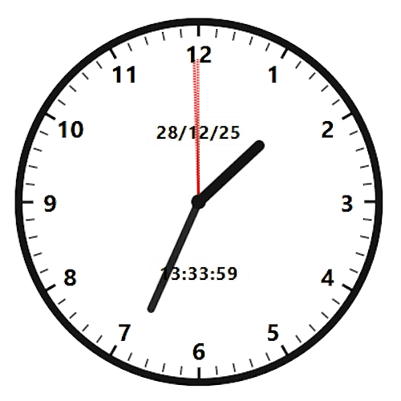

# 🕰️ Relógio Analógico em HTML + CSS + JS

## Sobre

Esse projeto nasceu de forma totalmente aleatória 😅

Eu estava **atoa esperando minha irmã terminar de se arrumar** e resolvi brincar um pouco com **HTML, CSS puro e um tiquinho de JavaScript** só pra passar o tempo… e acabou virando um reloginho analógico bem completo kkkkk.

Nada de frameworks, nada de bibliotecas — só código raiz mesmo.

---

## 🎥 Demonstração

> GIF do relógio funcionando



> 💡 Dica: coloque o GIF dentro de uma pasta `gif/` com o nome `relogio.gif`

---

## 📌 O que é o projeto?

Um **relógio analógico funcional**, feito do zero, que:

- Mostra as **horas, minutos e segundos** com ponteiros animados
- Possui **marcação de segundos** (60 risquinhos ao redor do relógio)
- Destaca os **marcadores de minuto** (a cada 5 segundos)
- Exibe **horário digital** no centro
- Mostra **data completa** (dia / mês / ano abreviado)
- Atualiza tudo em **tempo real**

---

## ⚙️ Tecnologias usadas

- **HTML5**
- **CSS3**
- **JavaScript puro**

---

## 🎨 Funcionalidades

- Ponteiros com movimento suave
- Horário digital no formato `HH:MM:SS`
- Data no formato `DD/MM/YY`
- Layout totalmente feito com CSS
- Código simples e fácil de entender

---

## 📁 Estrutura do projeto

```text
relogio/
│
├── index.html
├── favicon.ico
├── css/
│   └── style.css
├── js/
│   └── script.js
└── gif/
    └── relogio.gif

## 🚀 Como rodar

1. Clone o repositório
2. Abra o arquivo index.html no navegador
3. Pronto — o relógio já começa a funcionar ⏱️

## 😄 Observações finais

Esse projeto não tem nenhuma pretensão absurda — foi só uma brincadeira de fim de tarde que acabou ficando legal demais pra não salvar.
Se você também curte brincar com CSS e JS puro, fica aí a inspiração 😉

## 📜 Licença
Use, copie, modifique e se divirta.
```
